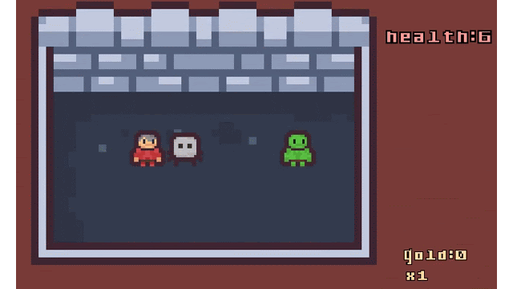

# Coin Dungeon

A lightweight 2D dungeon crawler where combat outcomes are determined by a coin flip, blending randomness with player progression.

## Technologies
- Unity 6.0 (6000.0.51f1)
- Zenject

## Features
- Unique combat system based on coin toss (heads / tails)
- Simple dungeon exploration loop
- Lightweight and fast-paced gameplay
- Clean and maintainable code structure (built during a game jam)
- Migrated on Zenject architecture 

## How to Run

1. Open the project in Unity Hub
2. Use Unity version: 6000.0.x (most likely will work on higher versions)
3. Open scene called "SampleScene"

## Controls

| Action        | Input              |
|--------------|--------------------|
| Move          | WASD / Arrow Keys |
| Interact/Fight| Automatic on contact |

## Development Focus

- End-to-end development:
- game design
- gameplay logic
- UI
- integration
- Focus on core mechanics over polish
- Writing maintainable code under time constraints
- Avoiding over-engineering while keeping structure clean

## Feature Demo:

[Video](https://drive.google.com/file/d/1t5QsbW6jkoxxWF_-2WFvw94dbY0rvGQV/view?usp=sharing)
